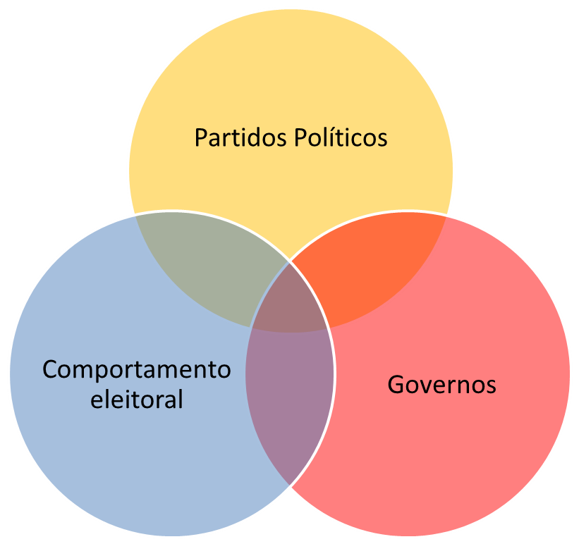

---
title: "AARE COMPORTAMENTO ELEITORAL E COMPETIÇÃO PELO VOTO"
author: "Vitor Peixoto e Renato Barreto"

        
date: "2º semestre de 2020"

output: html_document
---

```{r setup, include=FALSE}
knitr::opts_chunk$set(echo = TRUE)
```

# Ementa

Teorias clássicas do comportamento eleitoral: teoria sociologia do voto, teoria psicológica e teoria da escolha racional; Pos materialismo e mudança cultural, Conceitos de Partidos Políticos; Competição eleitoral, Ciclos eleitorais dos gastos públicos; Reeleição.


# Apresentação


O curso aborda a interseção entre três grandes dimensões da análise de sistemas políticos democráticos: governos, comportamento eleitoral e partidos políticos. O plano de voo é partir dos estudos sobre comportamento dos eleitores e aterrissar nos estudos sobre estratégias dos partidos políticos nas administrações públicas subnacionais com vistas à reeleição com escalas em trabalhos que abordaram ideologia partidária e gastos públicos no Brasil.


```{r pressure, echo=FALSE}


```

Primeiramente, serão abordadas as três principais teorias explicativas para as escolhas eleitorais dos cidadãos (teorias sociológicas, psicológicas e da escolha racional),  pos materialismo, atitudes democráticas e opinião pública.

Na segunda parte serão tratados temas como conceitos de partidos políticos e aspectos relacionados às estratégias eleitorais dos atores políticos para competição pelo voto. 


Por fim, abordar-se-ão comportamentos dos governos no que tange aos gastos públicos sociais e os impactos nas chances de reeleição.




Destarte, os principais temas de análise nesta disciplina podem ser resumidos da seguinte forma: teorias do comportamento eleitoral, ciclos eleitorais dos gastos sociais e reeleição.


# Conteúdo programático (contempla bibliografia obrigatória e complementar)


### 1º encontro:


Apresentação do curso as motivações, estabelcimento de regras, alertas sobre possíveis mudanças no decorrer do curso, esclarecimentos sobre processo de avaliação contínuo e final.


#### Leitura obrigatória:
  
  ASSIS, Machado. À opinião Pública. In: Obra Completa de Machado de Assis, Edições W.M. Jackson, 1937. Publicado originalmente em Diário do Rio de Janeiro, Rio de Janeiro, 1867. [LINK](https://www.google.com/url?sa=t&rct=j&q=&esrc=s&source=web&cd=&cad=rja&uact=8&ved=2ahUKEwjEoq3lsPjqAhU1GbkGHcaOC7sQFjAAegQIAxAB&url=http%3A%2F%2Fmachado.mec.gov.br%2Fobra-completa-lista%2Fitem%2Fdownload%2F57_51493500c619499d4be6eb28d2c9e146&usg=AOvVaw19hU-EvdzyoyEOwv7IC3B3)

## I) COMPORTAMENTO ELEITORAL 


### 2º encontro: origem e evolução das teorias do comportamento eleitoral
 
BARTELS, L. The study of electoral behavior of American elections and political behavior, 2008. [LINK](http://books.google.com.br/books?hl=pt-PT&lr=&id=0PLNhGk-MlgC&oi=fnd&pg=PA239&dq=bartels+the+study+of+electoral+behavior&ots=qAL6IhMM67&sig=PdKWFZ6sNh65vsYeJ_ezCdbkAjA)

CONVERSE, Philip. Researching Electoral Politics. The American Political Science Review, Vol. 100, No. 4.

CAMPBELL, A.; CONVERSE, P.; MILLER, W.; STOKES, D. The American voter. 1980. 

FIGUEIREDO, Marcus. A decisão do voto: democracia e racionalidade. São Paulo: Ed. Sumaré, 1991, pp: 12-42.


### 3º encontro: Controversia entre voto economico e estruturas sociais 

BERELSON, B., LAZARSFELD, P. e McPHEE, W. Voting: A study of opinion formation in a presidential election.  Chicago: University of Chicago Press, 1966.

FIGUEIREDO, Marcus. A decisão do voto: democracia e racionalidade. São Paulo: Ed. Sumaré, 1991, pp: 43-68, 96-144.

LIPSET, Seymour M. O Homem Político. Rio de Janeiro: Zahar Editor. 1967. 


### 4º encontro: Voto econômico retrospectivo e prospectivo


FIORINA, Morris. Retrospective Voting in American Elections. New Haven: Yale University Press. 1981.

FIORINA, Morris. 1981. Economic Retrospective Voting in American National Elections: A Micro-Analysis. American Journal of Political Science, Vol. 22, No. 2 (May, 1978), pp. 426-443. [LINK](https://www.jstor.org/stable/pdf/2110623.pdf?casa_token=kcGtNXA9XGMAAAAA:FPRz3cO9FH-qBkik4WimLNs2skRriCWFlSa_sYXwPpJHqqkmZkrIYSvJsKc7q8Khj95_ys22f9fRhQDD-AlaCKfnB0OF8lqReSodicfDuHWS8Oc_S5o)

KIEWIET, D.  Roderick,  RIVERS, Douglas. A retrospective on retrospective voting. Political  Behavior. Agathon  Press,  Inc.  Vol, 6,  No,  4. 1984. [LINK](https://link.springer.com/content/pdf/10.1007/BF00987073.pdf)

KIEWIET, D.  Roderick . Macroeconomics and micropolitics: The electoral effects of economic issues. Chicago: University of Chicago Press, 1983.

LEWIS-BECK, Michael, PALDAM, Martin. Economic voting: an introduction. Electoral Studies, vol 19 , pp: 113–121, 2000. [LINK](https://d1wqtxts1xzle7.cloudfront.net/6179351/s4._economic_voting_an_introduction__lewis-beck_paldam_2000_.pdf?response-content-disposition=inline%3B+filename%3DEconomic_Voting_An_Introduction.pdf&Expires=1596232053&Signature=E6yy7sQ2jl9Pl1WjQWSNabYtHHA6C43MnggdKtEX9BblNDlYruECHsxCyXLi6Sos-UG5Ks7eqPbxVGWBtE~vUH4XOnCDoN8ENE-wj0POV4HVgRrVNvJ5Mk582791aAsw34Nd~qEk4FLDhjeseAhVvqUlUrVv69JNiv6yqXRArUvHMKW2AaPd~CIn9ZLqu-rjoHgXhd0FssXksXZ9DsZSNSU9fNT3pNE2U-FtrcM8lT9nRZdcbANo~1zrzPpc55hUPEGxaCsqDHlgTIstMi-5T7giaF9biMqjR9fCnXtE5h5YDUedb1IcL1q9-LJjd9-87Tc~2znL9paQtMgp1~bDgg__&Key-Pair-Id=APKAJLOHF5GGSLRBV4ZA)

LEWIS-BECK, Michael and STEGMAIER, Mary. "Economic Models of Voting" The Oxford Handbook of Political Behavior. Ed. Russell Dalton and Hans-Dieter Klingemann. Oxford: Oxford University Press, 2007. pp.518-537.


## II) PARTIDOS 


### 5º encontro: Mudanças culturais e Partidos Políticos

INGLEHART, Ronald; WELZEL, Christian. Modernização, mudança cultural e democracia: a sequência do desenvolvimento humano. Francis, 2009.

PANEBIANCO, Angelo; DE PARTIDO, Modelos. Organização e poder nos partidos políticos. São Paulo, 2005.

SEILER, Daniel-Louis. Os partidos políticos. UnB, 2000.


### 6º encontro: Identificacao partidaria e o voto no Brasil


DALTON, Russell J. (2000), "The Decline of Party Identifications", in R. J. Dalton e M. Wattenberg (eds.), Parties without Partisans – Political Changes in Advanced Industrial Democracies. Oxford, Oxford University Press. 

CARREIRAO, Yan de Souza; KINZO, Maria D'Alva G.. Partidos políticos, preferência partidária e decisão eleitoral no Brasil (1989/2002). Dados,  Rio de Janeiro ,  v. 47, n. 1, p. 131-167,    2004 . [LINK](http://www.scielo.br/scielo.php?script=sci_arttext&pid=S0011-52582004000100004&lng=en&nrm=iso)

BORBA, Julian. Cultura política, ideologia e comportamento eleitoral: alguns apontamentos teóricos sobre o caso brasileiro. Opin. Publica,  Campinas ,  v. 11, n. 1, p. 147-168,  Mar.  2005 .  [LINK](http://www.scielo.br/scielo.php?script=sci_arttext&pid=S0104-62762005000100006&lng=en&nrm=iso)

GIMENES, Éder Rodrigo et al. Partidarismo no Brasil: Análise longitudinal dos condicionantes da identificação partidária (2002-2014). 2016. [LINK](http://bibliotecadigital.tse.jus.br/xmlui/handle/bdtse/2493)

VEIGA, Luciana Fernandes. O partidarismo no Brasil (2002/2010). Opin. Publica,  Campinas ,  v. 17, n. 2, p. 400-425,  Nov.  2011 .   [LINK](http://www.scielo.br/scielo.php?script=sci_arttext&pid=S0104-62762011000200005&lng=en&nrm=iso) 


### 7º encontro: Voto economico no Brasil

VEIGA, Luciana Fernandes; ROSS, Steven Dutt. Os determinantes da avaliação da economia na eleição presidencial brasileira em 2014. Opin. Publica,  Campinas ,  v. 22, n. 3, p. 524-549,  Dec.  2016 .   [LINK](http://www.scielo.br/scielo.php?script=sci_arttext&pid=S0104-62762016000300524&lng=en&nrm=iso)


## III) GOVERNOS, POLÍTICAS PÚBLICAS E GASTOS SOCIAIS


### 8º encontro: Partidos, ideologia e Politicas Sociais

BATISTA, Cristiane. Partidos políticos, ideologia e política social na América Latina: 1980-1999. Dados,  Rio de Janeiro ,  v. 51, n. 3, p. 647-686,    2008 .  [LINK](http://www.scielo.br/scielo.php?script=sci_arttext&pid=S0011-52582008000300004&lng=en&nrm=iso)

BORSANI, Hugo. Eleições e Economia. Instituições políticas e resultados macroeconômicos na América Latina (1979-1998). Belo Horizonte: Editora UFMG. 
2003. Pp. 35- 89, 163-191.

RIBEIRO, Leandro Molhano. Partidos e políticas sociais nos municípios brasileiros. 2005. Tese de Doutorado. Tese de Doutorado em Ciência Política, IUPERJ/UCAM, Rio de Janeiro. 

ARRETCHE, Marta. Federalismo e igualdade territorial: uma contradição em termos?. Dados,  Rio de Janeiro ,  v. 53, n. 3, p. 587-620,    2010 .   [LINK](http://www.scielo.br/scielo.php?script=sci_arttext&pid=S0011-52582010000300003&lng=en&nrm=iso)


### 9º encontro: Modelos de avaliação e política de gastos dos partidos políticos


LAVAREDA, Antonio. Emoções ocultas e estratégias eleitorais. Ed. Objetiva, Rio de Janeiro, 2009.

MARCINIUK, Fernanda Ledo; BUGARIN, Maurício S. A influência da reeleição nas políticas fiscais subnacionais. Revista Brasileira de Economia, Rio de Janeiro, v. 73, n. 2, p. 181-212, 2019 [LINK](https://www.scielo.br/scielo.php?pid=S0034-71402019000200181&script=sci_arttext&tlng=pt)

MENEGUIN, Fernando B.; BUGARIN, Maurício. Reeleição e política fiscal: um estudo dos efeitos da reeleição nos gastos públicos. Revista de Economia Aplicada, Ribeirão Preto, v. 5, n. 3, p. 601-622, jul.-set. 2001.


MENEGUIN, Fernando B.; BUGARIN, Maurício; CARVALHO, Alexandre X. de. O que leva um governante à reeleição? Brasília: IPEA, 2005. (Textos para discussão n. 1135) [LINK](http://desafios2.ipea.gov.br/pub/td/2005/td_1135.pdf)


### 10º encontro: instituições eleitorais e reeleição 


ARAUJO JUNIOR, Ari Francisco de; CANÇADO, Paulo; SHIKIDA, Cláudio Djissey. ECONOMICS AND POLITICS: o que determina as chances de reeleição em municípios? o caso das eleições municipais de minas gerais – 2000. Informe Gepec, Cascavél, v. 9, n. 2, p. 1-22, 2005. [LINK](http://e-revista.unioeste.br/index.php/gepec/article/view/305/221)


CONCEIÇÃO, Bruno da Silva. Sistema eleitoral e reeleição nas eleições municipais de 2012 para o executivo no brasil. Revista Eletrônica de Ciência Política, Porto Alegre, v. 6, p. 11-25, 2015. [LINK](http://bibliotecadigital.tse.jus.br/xmlui/bitstream/handle/bdtse/2348/2015_conceicao_sistema_eleitoral_reeleicao.pdf?sequence=1&isAllowed=y)


MENDES, Marcos; ROCHA, Carlos Alexandre Amorim. Reeleição sob informação imperfeita: evidência para os municípios brasileiros. Textos para discussão do Departamento de Economia/UnB. Brasília: Ed. UnB, 2004a. 27 p. (Série Textos para Discussão, 313). [LINK](https://www.researchgate.net/profile/Alexandre_Rocha23/publication/330687644_Reeleicao_sob_Informacao_Imperfeita_Evidencias_para_os_Municipios_Brasileiros/links/5c4f4f04a6fdccd6b5d00d67/Reeleicao-sob-Informacao-Imperfeita-Evidencias-para-os-Municipios-Brasileiros.pdf)

OLIVEIRA, Adriano; SANTOS, Roberto. BOAS ADMINISTRAÇÕES ELEGEM CANDIDATOS?: uma análise do comportamento dos eleitores em sete capitais brasileiras nas eleições de 2008. Revista Debates, Porto Alegre, v. 3, n. 2, p. 116-138, 2009. [LINK](https://www.seer.ufrgs.br/debates/article/viewFile/10115/6850)


### 11º encontro: Morfologia das Reeleições de prefeitos no Brasil
 
BARRETO, Alvaro Augusto de Borba. Reeleição para o executivo municipal no brasil (2000-2008). Revista debates, Porto Alegre, v.3, n.2, p. 97-115, jul.-dez. 2009 [LINK](http://bibliotecadigital.tse.jus.br/xmlui/bitstream/handle/bdtse/6603/2009_barreto_reeleicao_executivo_municipal.pdf?sequence=1)

____________. Eleições municipais comparadas: a escolha do chefe do executivo no brasil e no uruguai e o impacto sobre os sistemas partidários locais (2000-2005). Revista Brasileira de Ciência Política, Brasília, n. 7, p. 285-318, abr.  2012. [LINK](https://www.scielo.br/scielo.php?pid=S0103-33522012000100012&script=sci_arttext&tlng=pt)

______________. CABEÇA E CORPO: INCUMBENT VERSUS PARTIDO NAS ELEIÇÕES MUNICIPAIS BRASILEIRAS (2000-2012). In: ABCP, 9., 2014, Brasília. Anais. p. 1-22. [LINK](http://bibliotecadigital.tse.jus.br/xmlui/bitstream/handle/bdtse/5707/2014_barreto_partido_eleicoes_municipais.pdf?sequence=1&isAllowed=y)


### 12º encontro: Teorias normativas e reeleição: o que é ser um bom prefeito?

CAVALCANTE, Pedro. Vale a pena ser um bom prefeito? Comportamento eleitoral e reeleição no Brasil. Opinião Pública, Campinas, vol. 21, nº 1, p. 87-104, abr. 2015. [LINK](https://www.scielo.br/scielo.php?pid=S0104-62762015000100087&script=sci_arttext&tlng=pt) 

OLIVEIRA, Maria Augusta Teixeira.  A accountability é bela: punição eleitoral e contas irregulares nas eleições para prefeito entre 2004-2016. 2017. 97f. Dissertação, Universidade Federal de Pernambuco. [LINK](https://attena.ufpe.br/bitstream/123456789/29804/1/DISSERTA%C3%87%C3%83O%20Maria%20Augusta%20Texeira%20de%20Oliveira.pdf)  


SAKURAI, Sergio Naruhiko. Testando a Hipótese de Ciclos Eleitorais Racionais nas Eleições dos Municípios Paulistas. Estudos Econômicos, SÃo Paulo, v. 2, n. 35, p. 297-315, jun. 2005. [LINK](https://www.scielo.br/scielo.php?pid=S0101-41612005000200003&script=sci_arttext&tlng=pt)

_______________; MENEZES FILHO, Naércio Aquino. POLÍTICA FISCAL E REELEIÇÃO NOS MUNICÍPIOS BRASILEIROS:: uma análise via dados em painel para o período 1988 - 2000. In: ENCONTRO NACIONAL DE ECONOMIA, 35., 2007, Recife. Anais.  p. 1-20. [LINK](https://www.researchgate.net/profile/Naercio_Menezes-Filho/publication/4731572_POLITICA_FISCAL_E_REELEICAO_NOS_MUNICIPIOS_BRASILEIROS_UMA_ANALISE_VIA_DADOS_EM_PAINEL_PARA_O_PERIODO_1988_-_2000/links/0fcfd51127b6ebb9f2000000/POLITICA-FISCAL-E-REELEICAO-NOS-MUNICIPIOS-BRASILEIROS-UMA-ANALISE-VIA-DADOS-EM-PAINEL-PARA-O-PERIODO-1988-2000.pdf)

SANTOS, André Marenco dos. Topografia do Brasil profundo: votos, cargos e alinhamentos nos municípios brasileiros. Opinião Pública, Campinas, n. 18, p. 1-20, jun. 2013. [LINK](https://www.scielo.br/scielo.php?pid=S0104-62762013000100001&script=sci_arttext&tlng=pt)


## AVALIAÇÃO FINAL (Entrevistas e Entrega de trabalhos)


## Quetões importantes:

 - Os textos não disponíveis em links públicos deverão ser procurados pelos discentes de acordo com as possibilidades e necessidades. Desde que sem fins comerciais estimulamos a busca por alternativas colaborativas.
 
 - Não pactuamos com a pirataria ou qualquer outra violação do direito de propriedade intelectual/material.
 
 - A participação nos debates será de grande importancia e fará parte do processo contínuo de avaliação.
 
 - O discente poderá, de acordo com a regulamentação das AAREs, desistir de participar sem qualquer prejuízo, todavia **não aceitaremos inscrições** no curso após o segundo encontro.
 
 - As leituras prévias dos textos selecionados são fundamentais para a participação com qualidade mínima. Se não leu, prefira não comparecer para investir o tempo na leitura do texto. O encontro síncrono não substituirá, em hipótese alguma, a leitura.
 
 - É proibida qualquer gravação e/ou reproduação tanto do áudio quanto do vídeo sem a expressa autorização dos docentes responsáveis por esta AARE.
 
 - Eventualmente, serão escolhidos discentes para apresentações de textos e/ou de suas pesquisas próprias que guardem confluência com os temas debatidos pela literatura.
 
 - Alunos de iniciação científica do Núcleo de Estudos em Representação e Democracia estão autorizados a participar como ouvintes desta AARE.
 
 
 
